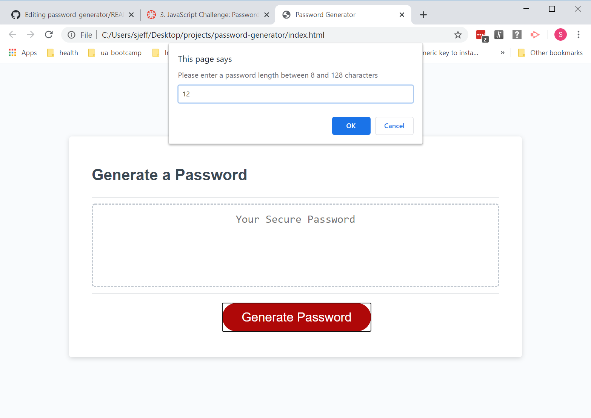
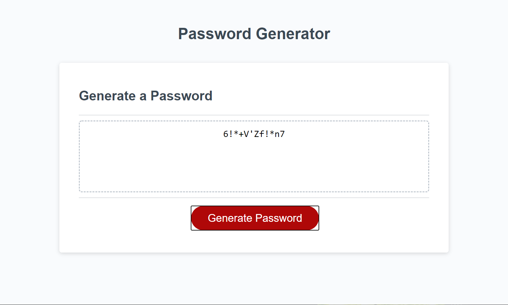

# Password Generator

## Content Requirements

* GIVEN I need a new, secure password
* WHEN I click the button to generate a password
* THEN I am presented with a series of prompts for password criteria
* WHEN prompted for password criteria
* THEN I select which criteria to include in the password
* WHEN prompted for the length of the password
* THEN I choose a length of at least 8 characters and no more than 128 characters
* WHEN prompted for character types to include in the password
* THEN I choose lowercase, uppercase, numeric, and/or special characters
* WHEN I answer each prompt
* THEN my input should be validated and at least one character type should be selected
* WHEN all prompts are answered
* THEN a password is generated that matches the selected criteria
* WHEN the password is generated
* THEN the password is either displayed in an alert or written to the page

``` JS 
function generatePassword() {
  var length = getPasswordLength();
  var charTypes = getUserSelection();
  passwordString = "";
  for (i = 0; i < length; i++) {
    //generate random number based on number of character types the user has selected to index charTypes array
    var randomNumber = Math.floor(Math.random() * charTypes.length);
    var chooseType = charTypes[randomNumber];
    switch (chooseType) {
      case 0:
        passwordString += Math.floor(Math.random() * 9).toString();
        break;
      case 1:
        passwordString += String.fromCharCode(Math.floor(Math.random() * 26) + 97);
        break;
      case 2:
        passwordString += String.fromCharCode(Math.floor(Math.random() * 26) + 65);
        break;
      case 3:
        passwordString += String.fromCharCode(Math.floor(Math.random() * 14) + 33);
        break;
      default:
        console.log("No case selected. Please review!");
        break;
    }
  }
  console.log(passwordString);
  return passwordString;
}
```



https://essennejaye.github.io/password-generator/
